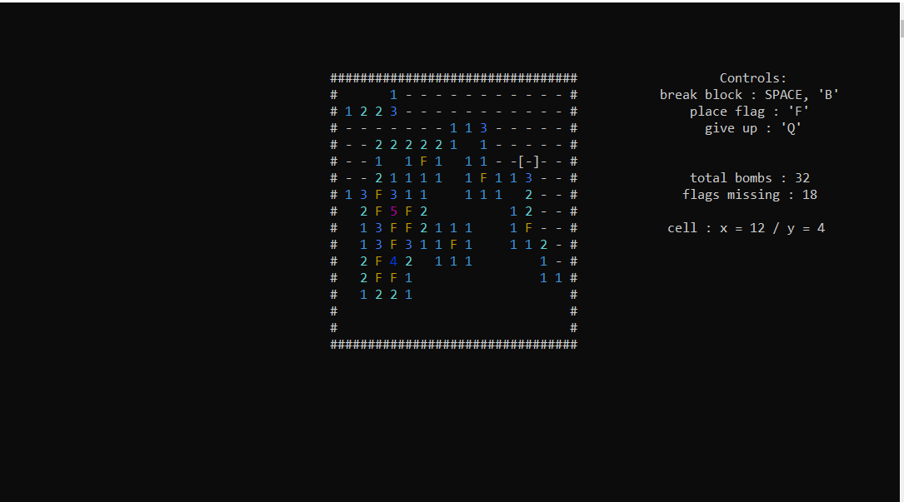

# Minesweeper-c

A simple MineSweeper game built in **December 2022**. It was developed in **two weeks** as a fun project.

## Screenshot

## How to Play

- Use the arrow keys to move the cursor.
- Place flags with F where you think there might be a bomb.
- Avoid breaking a bomb block!

## Features

- Classic minesweeper gameplay
- Minimalistic but colorful graphics
- Simple mechanics but some customization like: board size, bombs percentage, and color disabling.

## Technologies Used

- **Language:** C

## Setup

1. Clone the repository
2. Compile the main file and run its executable
